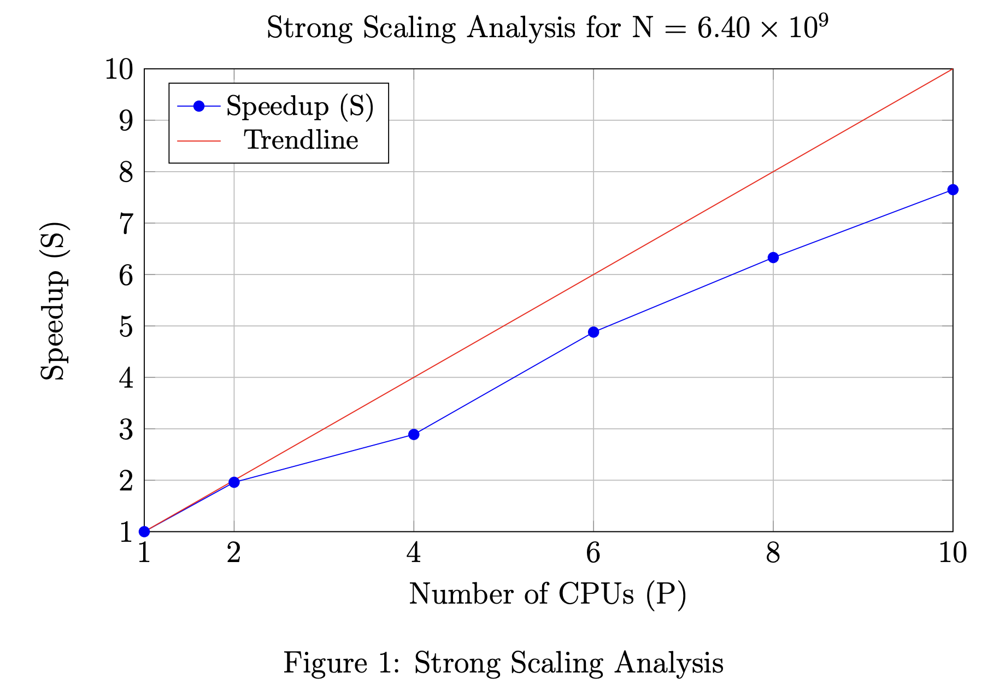
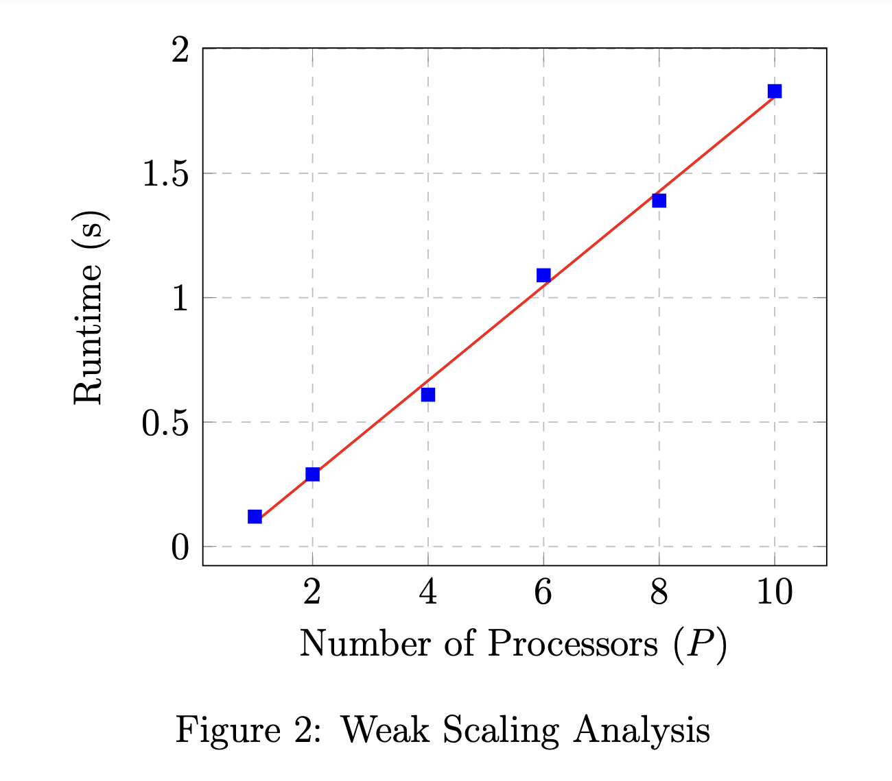

# Intro to Parallel and Distributed Processing - A0

**Author:** Suvigya Vijay 

## Introduction

In this report, we analyze the scalability of a parallel code. We investigate the behavior of the code under varying input parameters and the number of processors. Specifically, we aim to answer the following questions:

1. What is the tested code doing? (Discussed in Section 2)
2. What is the complexity of the code with respect to the input parameters? (Discussed in Section 3)
3. How does the code's performance scale with an increasing number of processors? (Discussed in Section 4)

## Code Functionality

The tested code performs a matrix-vector multiplication (DGBMV) operation. It includes both a sequential version (`dmv`) and a parallel version (`omp_dmv`) implemented using OpenMP. The code takes two integer parameters, *n* and *m*, representing the dimensions of the matrix *A* (a two-dimensional array with *n* rows and *m* columns) and the vector *x* (a vector of length *m*). The code initializes these matrices and vectors, performs the matrix-vector multiplication, and measures the execution time.

The matrix-vector multiplication operation involves multiplying each row of the matrix *A* by the corresponding element of the vector *x* and accumulating the results in the output vector *y*. In the parallel version (`omp_dmv`), OpenMP is employed to distribute the work across multiple threads. Each thread works on a subset of the rows of the matrix *A* to perform the multiplication, allowing for concurrent computation.

The primary purpose of this code is to compare the performance of the sequential and parallel implementations in terms of execution time, particularly for large matrix sizes and multi-core processors.

## Code Complexity

The code complexity of the matrix-vector product in this implementation, both in the sequential (`dmv`) and parallel (`omp_dmv`) versions, is O(*n* * *m*). This complexity arises due to the two nested loops that iterate across the matrix dimensions. As a result, with an increase in the input size, which includes both the number of rows (*n*) and columns (*m*), the runtime will increase quadratically.

In the case of the parallel implementation (`omp_dmv`), the code can effectively leverage processors by distributing the workload across the rows of the matrix *A*. This parallelization strategy takes advantage of the fact that the matrix-vector multiplication operation across different rows is independent. In an ideal case with *p* processors, the runtime complexity of the parallel code should be O(*n* * *m* / *p*), indicating a potential speedup when utilizing multiple processors.

## Scalability Analysis

### Experimental Setup

#### Hardware and Software Specifications

The experiments were conducted on a parallel computing system with the following specifications:

- **CPU:** Intel(R) Xeon(R) Gold 6130 CPU @ 2.10GHz
- **RAM:** 196GB
- **Operating System:** CentOS Linux 7 (Core)
- **Compiler:** g++ (Gentoo 10.4.0 p5) 10.4.0 with OpenMP 5.0
- **Compiler Flags:** O3 optimization and C++20 standard (-fopenmp -std=c++20 -O3)

Detailed information on the hardware and software specifications is available in the appendix.

#### Input Parameter Variations

For the experiments conducted, the matrix dimensions (*m* and *n*) were set to be equal, i.e., *m* = *n*. The value of *n* was varied to assess the code's behavior under different problem sizes. The values were chosen to ensure that the runtime with multiple processors maintains a precision of 0.1 seconds. Specifically, *n* was set to the following values: 10000, 20000, 40000, 60000, 80000, and 100000.

The number of processors (*p*) was also varied to analyze the code's performance under different levels of parallelism. The processor values were chosen to ensure experiments can be conducted while maintaining a constant $N/P$ ratio without surpassing memory limits. The following processor counts were used: 1 (representing a sequential run), 2, 4, 6, 8, and 10.

#### Scripting

To facilitate the systematic execution of our scalability experiments, Python scripts were used to generate Slurm batch jobs and parse the generated output. This scripting approach enabled the automation of varying input parameters, such as problem size and processor count, and the collection of runtime data efficiently. For reference, Python scripts used in the experiments are provided in the appendix.

Additionally, it's worth noting that the generated data can be regenerated by running the experiment with the following command:

```bash
python3 schedule.py --script_name test.sh 
                    --job_name test 
                    --time 01:00:00 
                    --nodes 1 
                    --memory 128G 
                    --max_cpus 10 
                    --max_input_size 10000000000 
                    --arch AVX512
```

### Experiment Results

The following table presents the results of the experiments conducted to assess the performance and scalability of the matrix-vector multiplication code for varying problem sizes and numbers of processors (P/N). The reported values represent the execution time in seconds for each combination of problem size and processor count.

<div align="center">

| **P/N** | **10,000** | **20,000** | **40,000** | **60,000** | **80,000** | **100,000** |
|---------|------------|------------|------------|------------|------------|-------------|
| **1**   | 0.12       | 0.51       | 2.01       | 4.47       | 8.79       | 14.13       |
| **2**   | 0.08       | 0.29       | 1.13       | 2.52       | 4.49       | 7.25        |
| **4**   | 0.09       | 0.20       | 0.61       | 1.72       | 3.04       | 4.63        |
| **6**   | 0.07       | 0.16       | 0.46       | 1.09       | 1.80       | 2.80        |
| **8**   | 0.06       | 0.14       | 0.39       | 0.78       | 1.39       | 2.11        |
| **10**  | 0.06       | 0.13       | 0.39       | 0.69       | 1.15       | 1.83        |

</div>

### Strong Scaling Analysis

To assess the strong scaling of the system, we use the generated data for a fixed input size of *m* = *n* = $80000$ as the runtime values have the right precision. The strong scaling analysis measures how the runtime of the code changes as the number of CPUs (P) increases while keeping the problem size constant. The results are summarized in the table below.

<div align="center">

| **P** | **Runtime (s)** | **Speedup (S)** | **Efficiency (E)** |
|-------|------------------|------------------|---------------------|
| **1** | 8.79             | 1.00             | 100\%                |
| **2** | 4.49             | 1.96             | 98\%                 |
| **4** | 3.04             | 2.89             | 72\%                 |
| **6** | 1.80             | 4.88             | 81\%                 |
| **8** | 1.39             | 6.33             | 79\%                 |
| **10**| 1.15             | 7.65             | 77\%                 |

</div>

<p align="center">
    
</p>

From the strong scaling analysis, we observe that as the number of CPUs increases, the speedup (S) initially improves but starts to exhibit diminishing returns. Efficiency (E) also decreases as more CPUs are added, indicating suboptimal utilization of processors beyond a certain point.

### Weak Scaling Analysis

To assess the weak scaling of the system, we consider the diagonal values of the experiment data while keeping the ratio $N/P$ fixed. This analysis evaluates how the runtime changes when both the problem size $N$ and the number of processors $P$ are scaled proportionally. The results are shown in Table below.

<div align="center">

| **N/P** | **P**   | **Runtime (s)** |
|---------|---------|------------------|
| 1       | 10000   | 0.12             |
| 2       | 20000   | 0.29             |
| 4       | 40000   | 0.61             |
| 6       | 60000   | 1.09             |
| 8       | 80000   | 1.39             |
| 10      | 100000  | 1.83             |

</div>

<p align="center">
    
</p>

In the weak scaling analysis, we observe that the runtime increases linearly across the diagonal values, indicating good weak scaling behavior as we are keeping $N/P$ fixed for a problem complexity of $O(n^2)$. This suggests that the code can efficiently handle larger problem sizes by scaling both the input and the number of processors proportionally.

## Conclusion

In this analysis, we examined the scalability of a parallel matrix-vector multiplication code. The code showcases strong weak scaling behavior, indicating its suitability for applications with varying input sizes. However, strong scaling shows diminishing returns indicating that the problem encounters suboptimal scaling efficiency beyond a certain number of processors.

In conclusion, our findings provide valuable insights for system configuration and optimization strategies when employing the matrix-vector multiplication code in real-world applications.
