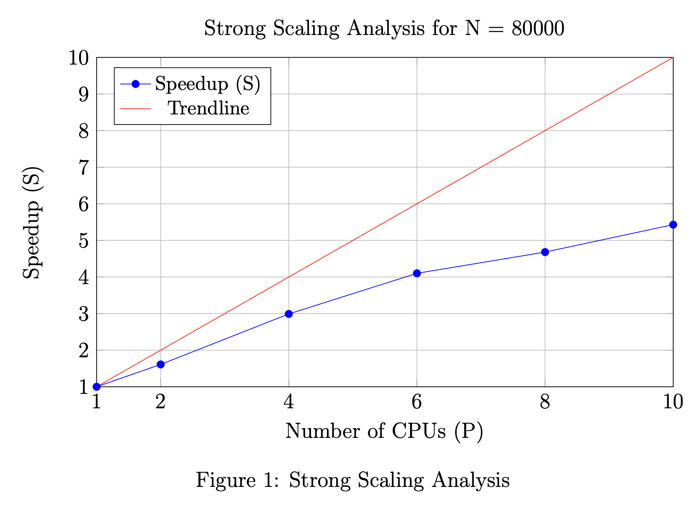
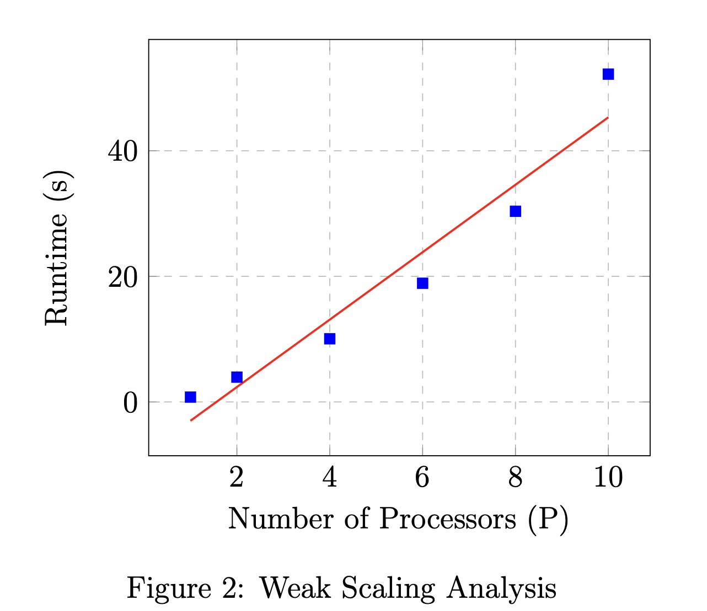

# Intro to Parallel and Distributed Processing - A1

**Author:** Suvigya Vijay 

## Introduction
Efficient 2D filter implementation is vital in image and signal processing. These filters are essential for improving digital images and signal data. In this report, we delve into the design and analysis of an OpenMP program tailored to speed up 2D filter applications. Our main goal is to improve the performance of this fundamental process in image and signal processing.

## Problem Description
In this report, we address the efficient application of a 2D filter to a digital image represented by a 2D array $ A $ with dimensions $ n \times m $. The filter leverages a $ 3 \times 3 $ kernel matrix denoted as $ K $, following the conventional stencil pattern employed in image processing.

Our focus shifts to a modified approach. We compute the matrix product between the $ 3 \times 3 $ submatrix of $ A $ centered at each pixel $ A_{i,j} $, referred to as $ A_{i-1:i+1, j-1:j+1} $, and the kernel $ K $. This operation yields a new matrix $ Z $, and the filtered value $ A'_{i,j} $ is obtained by summing all elements in $ Z $. It is essential to note that the filter excludes the first and last rows and columns of $ A $, maintaining the original pixel value if $ i $ or $ j $ falls within these boundaries.

Our objective is to devise an efficient method, potentially leveraging OpenMP, to expedite the application of this modified 2D filter, enhancing computational performance while operating within the problem's specified constraints.

## Proposed Solution
In this section, we present an approach to efficiently apply 2D filters and optimize the performance of the task. Our methodology includes a detailed examination of the expanded calculation process and a focus on efficient parallelization techniques.

### Matrix Product Calculation
To streamline the application of 2D filters, we first delve into the matrix product calculation of $ A'_{i,j} $. This step helps us gain a deeper understanding of the process and sets the stage for improved efficiency. Specifically, we break down the calculation for a single cell, such as $ A'_{1,1} $, using matrices $ Z $ and $ K $.

$$
Z = \begin{bmatrix}
a_{11} & a_{12} & a_{13} \\
a_{21} & a_{22} & a_{23} \\
a_{31} & a_{32} & a_{33}
\end{bmatrix}
$$

$$
K = \begin{bmatrix}
k_{11} & k_{12} & k_{13} \\
k_{21} & k_{22} & k_{23} \\
k_{31} & k_{32} & k_{33}
\end{bmatrix}
$$

The matrix product $ ZK $ represents the product of matrices $ Z $ and $ K $, where all elements of the resulting matrix product are summed up. Consequently, this matrix product calculation can be expressed as:

$$
A'_{1,1} = \sum ZK_{ij}
$$

This is equivalent to:

$$
= (a_{11}+a_{12}+a_{13}) \cdot (k_{11}+k_{21}+k_{31}) 
$$
$$
+ (a_{21}+a_{22}+a_{23}) \cdot (k_{12}+k_{22}+k_{32}) 
$$
$$
+ (a_{31}+a_{32}+a_{33}) \cdot (k_{13}+k_{23}+k_{33})
$$

Similarly, we calculate $ A'_{i,j} $ by summing three products:

$$
A'_{i,j} = (a_{i-1,j-1} + a_{i-1,j} + a_{i-1,j+1}) \cdot K_1  
$$
$$
+ (a_{i,j-1} + a_{i,j} + a_{i,j+1}) \cdot K_2  
$$
$$
+ (a_{i+1,j-1} + a_{i+1,j} + a_{i+1,j+1}) \cdot K_3
$$

Here, $ K_1 $, $ K_2 $, and $ K_3 $ are constants computed from the kernel $ K $:

$$
K_1 = (k_{11}+k_{21}+k_{31})
$$
$$
K_2 = (k_{12}+k_{22}+k_{32}) 
$$
$$
K_3 = (k_{13}+k_{23}+k_{33})
$$ 

Let's define $ PartialSum_{i,j} $ as:

$$
PartialSum_{i,j} = a_{i,j-1} + a_{i,j} + a_{i,j+1}
$$

Then we can express $ A'_{i,j} $ as:

$$
A'_{i,j} = PartialSum_{i-1,j} \cdot K_1 + PartialSum_{i,j} \cdot K_2 + PartialSum_{i+1,j} \cdot K_3
$$

Efficiently performing this matrix product calculation is crucial to enable in-place filter computation. This approach significantly improves performance by eliminating the necessity of time-consuming memory allocation for a new matrix.

### Efficient Parallelization
In this section, we explore how to parallelize the computation of $ A'_{i,j} $, as derived in the previous section, to optimize the performance of the 2D filtering operation. We dissect the computation into the summation of three distinct products. Specifically:

\begin{equation}\label{eq:product1}
PartialSum_{i-1,j} \cdot K_1
\end{equation}
\begin{equation}\label{eq:product2}
PartialSum_{i,j} \cdot K_2
\end{equation}
\begin{equation}\label{eq:product3}
PartialSum_{i+1,j} \cdot K_3
\end{equation}

Let's examine each of these product terms individually to harness the parallelization capabilities offered by OpenMP.

#### Precomputation of Constants
Firstly, it's important to note that $ K_1 $, $ K_2 $, and $ K_3 $ are constants that are derived from the kernel matrix $ K $. These constants are computed in constant time and stored in memory for reuse, significantly improving computational efficiency.

#### Row-Wise Parallelization
Our next step in achieving efficient parallelization focuses on row-wise processing. This approach involves the following key steps:

1. We noticed that each part in Equations (\ref{eq:product1}), (\ref{eq:product2}), and (\ref{eq:product3}) needs the value of $ PartialSum_{i,j} $ which is calculated using the neighboring cell values of $ A_{i,j} $ where $ j $ changes from $ j-1 $ to $ j+1 $. We can calculate $ PartialSum_{i,j} $ for each part at the same time across the rows of matrix $ A $.
2. To update the values for $ PartialSum_{i,j} $ in place, we add $ PartialSum_{i-1,j} $ and $ a_{i+1,j} $ and then subtract $ a_{i-2,j} $ while using a temporary variable to keep track of it.
3. This parallel method of calculating the partial sums for each cell minimizes computational overhead because it's all done in place. We use OpenMP with `omp parallel for` to parallelize this process across rows.

#### Column-Wise Parallelization
Having obtained the partial sums across rows, we proceed with column-wise parallelization, which consists of the following steps:

1. Since each row has $ PartialSum_{i,j} $, where $ i $ is the row index and $ j $ is the column index, we can efficiently calculate $ A'_{i,j} $ by going through each column element and multiplying it by the corresponding $ K_p $ where $ p = [1,2,3] $.
2. We calculate it in place by keeping $ PartialSum_{i-1,j} $ in a temporary variable to make things smoother.
3. To do this in parallel across columns, we make use of OpenMP with `omp parallel for`.

## Scalability Analysis

### Experimental Setup

#### Hardware and Software Specifications
The experiments were conducted on a parallel computing system with the following specifications:

- **CPU:** Intel(R) Xeon(R) Gold 6130 CPU @ 2.10GHz
- **RAM:** 128GB
- **Operating System:** CentOS Linux 7 (Core)
- **Compiler:** g++ (Gentoo 10.4.0 p5) 10.4.0 with OpenMP 5.0
- **Compiler Flags:** O2 optimization and C++17 standard (-fopenmp -std=c++17 -O2)

#### Input Parameter Variations
For the experiments conducted, the matrix dimensions ($ m $ and $ n $) were set to be equal, i.e., $ m = n $. The value of $ n $ was varied to assess the code's behavior under different problem sizes. The values were chosen to ensure that the runtime with multiple processors maintains a precision of 0.1 seconds. Specifically, $ n $ was set to the following values: 10000, 20000, 40000, 60000, 80000, and 100000.

The number of processors ($ p $) was also varied to analyze the code's performance under different levels of parallelism. The processor values were chosen to ensure experiments can be conducted while maintaining a constant $ N/P $ ratio without surpassing memory limits. The following processor counts were used: 1 (representing a sequential run), 2, 4, 6, 8, and 10.

### Experiment Results

The following table presents the results of the experiments conducted to assess the performance and scalability of the matrix-vector multiplication code for varying problem sizes and numbers of processors (P/N). The reported values represent the mean execution time in seconds for each combination of problem size and processor count.

| **P/N** | **10,000** | **20,000** | **40,000** | **60,000** | **80,000** | **100,000** |
|---------|------------|------------|------------|------------|------------|-------------|
| **1**   | 0.77       | 5.89       | 30.65      | 70.75      | 142.23     | 211.78      |
| **2**   | 0.82       | 3.95       | 19.28      | 43.53      | 88.18      | 126.08      |
| **4**   | 0.54       | 1.89       | 10.06      | 24.27      | 47.56      | 80.37       |
| **6**   | 0.50       | 1.29       | 7.47       | 18.90      | 34.70      | 69.05       |
| **8**   | 0.41       | 1.06       | 5.94       | 16.25      | 30.36      | 58.31       |
| **10**  | 0.40       | 0.90       | 5.05       | 14.44      | 26.20      | 52.20       |

### Strong Scaling Analysis

To assess the strong scaling of the system, we use the generated data for a fixed input size of $ m = n = 80000 $ as the runtime values have the right precision. The strong scaling analysis measures how the runtime of the code changes as the number of CPUs (P) increases while keeping the problem size constant. The results are summarized in the table below.

| **P**   | **Runtime (s)** | **Speedup (S)** | **Efficiency (E)** |
|---------|------------------|------------------|--------------------|
| **1**   | 142.23           | 1.00             | 100\%               |
| **2**   | 88.18            | 1.61             | 81\%                |
| **4**   | 47.56            | 2.99             | 75\%                |
| **6**   | 34.70            | 4.10             | 68\%                |
| **8**   | 30.36            | 4.68             | 59\%                |
| **10**  | 26.20            | 5.43             | 54\%                |

    

The graph shows a trend of increasing speedup with the addition of more CPUs, but the rate of increase in speedup diminishes as the number of CPUs grows. This indicates that while the code scales well up to a certain point, adding more CPUs beyond this point leads to less efficient utilization of computational resources.

### Weak Scaling Analysis

To assess the weak scaling of the system, we consider the diagonal values of the experiment data while keeping the ratio $ N/P $ fixed. This analysis evaluates how the runtime changes when both the problem size $ N $ and the number of processors $ P $ are scaled proportionally. The results are shown in Table \ref{table:weak_scaling}.

| **N/P** | **P**   | **Runtime (s)** |
|--------------|---------|------------------|
| 1            | 10000   | 0.77             |
| 2            | 20000   | 3.95             |
| 4            | 40000   | 10.06            |
| 6            | 60000   | 18.90            |
| 8            | 80000   | 30.36            |
| 10           | 100000  | 52.20            |

    

The weak scaling graph shows an almost linear increase in runtime as the problem size and the number of processors increase proportionally. This indicates that the code maintains its efficiency across different scales of the problem, effectively handling larger data sizes by proportionally increasing the computational resources.

## Conclusion

In this report, we've addressed the challenge of efficiently applying a 2D filter to a digital image using a $3 \times 3$ kernel matrix. We introduced a solution that optimizes the process through matrix product calculation and efficient parallelization.

The scalability analysis of our method yields crucial insights. Strong scaling analysis shows significant speedups with added parallelism, but efficiency plateaus as more processors are used, suggesting an optimal parallelism level. Conversely, weak scaling analysis demonstrates our method's adeptness at handling growing problem sizes and processor counts concurrently, maintaining consistent efficiency. The runtime's linear increase with proportional growth in problem size and processor count underscores our approach's scalability. Overall, these analyses highlight the robustness of our solution in adapting to varied computational demands.

In conclusion, our approach significantly improves the efficiency of 2D filtering, exploiting arithmetic simplifications to gain better parallel performance.
