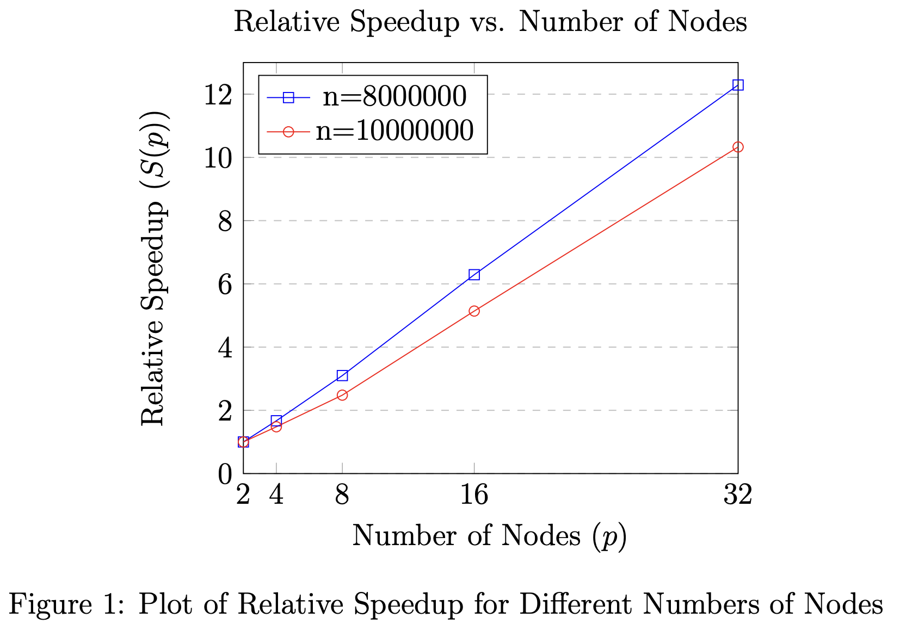

# Intro to Parallel and Distributed Processing - A2

**Author:** Suvigya Vijay 

## Introduction

This report presents a detailed analysis of the performance and scalability of an MPI-based program designed to sort small integers in distributed memory. The aim is to assess the scalability and efficiency of the implemented solution, under varying conditions of processor count and problem size.

## Code Functionality

The implemented MPI program is designed to sort an array of small integers distributed across multiple processors. The array, represented as $X = [x_0, x_1, \ldots, x_{n-1}]$, is divided into partitions across $p$ processors. The sorting algorithm ensures that equal keys are assigned to the same processor and that the keys are ordered across the processors. 

The core of the implementation is the `isort` function, which employs non-blocking sends and receives to distribute and collect the keys to the appropriate processors based on their values.

## Scalability Analysis

### Experimental Setup

#### Hardware and Software Specifications

The experiments were conducted on the CCR computing cluster with the following specifications:

- **CPU:** Intel(R) Xeon(R) Gold 6230 CPU @ 2.10GHz
- **RAM:** 128GB
- **Operating System:** CentOS Linux 7 (Core)
- **Compiler:** mpicxx (Version icpc (ICC) 2021.5.0 20211109)
- **Compiler Flags:** O2 optimization and C++17 standard

#### Input Parameter Variations

The input size $n$ (number of integers to sort) and the number of nodes $p$ were varied to analyze the scalability of the implemented sorting algorithm. Two different values of $n$ were tested: 8,000,000 and 10,000,000. The number of nodes was varied from 2 to 32.

### Experiment Results

The following table presents the experiment results, including the runtimes for different numbers of nodes $p$ and the calculated relative speedups, defined as $S(p) = T(2) / T(p)$. The speedup is calculated separately for each input size $n$.

<table align="center">
  <thead>
    <tr>
      <th rowspan="2" style="text-align: center;">Nodes</th>
      <th colspan="2" style="text-align: center;">n=8000000</th>
      <th colspan="2" style="text-align: center;">n=10000000</th>
    </tr>
    <tr>
      <th style="text-align: center;">Runtime(s)</th>
      <th style="text-align: center;">Speedup</th>
      <th style="text-align: center;">Runtime(s)</th>
      <th style="text-align: center;">Speedup</th>
    </tr>
  </thead>
  <tbody>
    <tr>
      <td>2</td>
      <td>34.7395</td>
      <td>1</td>
      <td>35.4519</td>
      <td>1</td>
    </tr>
    <tr>
      <td>4</td>
      <td>20.857</td>
      <td>1.67</td>
      <td>23.8891</td>
      <td>1.48</td>
    </tr>
    <tr>
      <td>8</td>
      <td>11.2244</td>
      <td>3.1</td>
      <td>14.2599</td>
      <td>2.48</td>
    </tr>
    <tr>
      <td>16</td>
      <td>5.52424</td>
      <td>6.29</td>
      <td>6.89615</td>
      <td>5.14</td>
    </tr>
    <tr>
      <td>32</td>
      <td>2.8253</td>
      <td>12.29</td>
      <td>3.43321</td>
      <td>10.33</td>
    </tr>
  </tbody>
</table>

This table demonstrates the relative speedup of the sorting algorithm as the number of nodes increases. As expected, the speedup increases with the number of nodes, indicating improved performance and scalability of the algorithm for larger node counts. This trend is observed for both tested input sizes, $n = 8000000$ and $n = 10000000$.

### Relative Speedup Plot

The relative speedup of the algorithm for varying numbers of nodes is visualized in the plot below. The plot compares the speedup for the two different input sizes.

    

### Scalability Analysis

The scalability of the MPI sorting algorithm can be assessed by analyzing the relative speedup achieved with varying numbers of nodes. Our findings indicate an overall positive trend in scalability. As the number of nodes increases, the algorithm demonstrates enhanced performance, particularly noticeable when adding more number of nodes. This trend is consistent for both the smaller and larger input sizes, highlighting the algorithm's ability to effectively leverage additional computational resources. However, the performance gain exhibits a diminishing pattern, particularly as we progress towards a higher number of nodes. 

The observed constraints in scalability, especially for larger input sizes, can largely be attributed to the less optimal design of the sorting algorithm. The current implementation relies on manual Send and Receive operations in MPI, which, while functional for smaller scales, tends to increase communication costs disproportionately as the number of nodes grows. This is in contrast to potentially more efficient approaches, such as using AllReduce, which could streamline data distribution and reduce overheads. Consequently, while the algorithm demonstrates commendable scalability with smaller data sizes and a moderate number of nodes, its performance does not scale as efficiently with larger data sizes and higher node counts. This realization underscores the need for revisiting the algorithm's design, particularly focusing on optimizing its communication patterns and data handling strategies.

## Conclusion

In summary, the analysis of our MPI-based sorting algorithm has highlighted its scalability benefits for smaller data sizes and a moderate number of nodes, while also uncovering challenges in scaling efficiency at larger sizes and higher node counts. The primary bottleneck appears to be the suboptimal use of manual Send and Receive operations in MPI, rather than employing more efficient approaches like AllReduce. This finding underscores the need for algorithmic optimization, particularly in enhancing MPI communication patterns, to improve scalability and performance in various scenarios.
