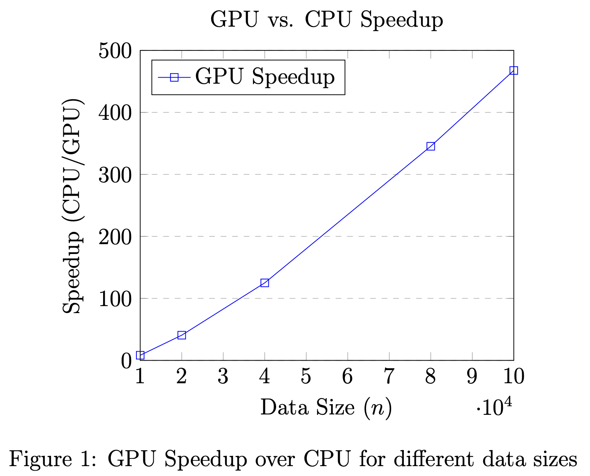

# Intro to Parallel and Distributed Processing - A3

**Author:** Suvigya Vijay 

## Introduction

This report presents a performance analysis of Gaussian Kernel Density Estimation (KDE) implemented using NVIDIA CUDA. The focus is on evaluating the efficiency of the CUDA implementation in comparison to CPU-based computation. The report addresses the following aspects:

1. Analyzing the performance and runtime of the CUDA implementation with varying data sizes.
2. Comparing the CUDA implementation's performance against a CPU-based approach.

## CUDA Implementation of Gaussian KDE

The Gaussian KDE is a non-parametric way to estimate the probability density function of a dataset. In this implementation, the Gaussian kernel function is computed in parallel for different data points using CUDA. The implementation focuses on maximizing efficiency by utilizing shared memory and optimizing memory transfers between the CPU and GPU.

The primary challenge addressed in this implementation is to efficiently handle large datasets that exceed the capacity of a single CUDA thread block but are small enough for a single kernel invocation.

## Performance Analysis

### Experimental Setup

The performance analysis was conducted on the CCR cluster with the following CPU and GPU specifications:

- **CPU:** Intel(R) Xeon(R) Gold 6230 CPU @ 2.10GHz
- **RAM:** 32GB
- **Operating System:** CentOS Linux 7 (Core)
- **Compiler:** nvcc
- **Compiler Flags:** O2 optimization
- **GPU Model:** Tesla V100-PCIE-32GB
- **Driver Version:** 470.57.02
- **CUDA Version:** 11.4
- **Memory:** 32510 MiB

The dataset sizes tested varied, with $ n $ ranging from 10,000 to 4,000,000, and the bandwidth $ h $ set to 0.1. These configurations were chosen to evaluate the scalability and efficiency of the CUDA implementation across different data sizes.

### Experiment Results

The following table summarizes the runtime (in seconds) of the Gaussian KDE computation for different values of $ n $, comparing the GPU and CPU performances:

| **n** | **GPU Runtime (s)** | **CPU Runtime (s)** | **Speedup** |
|------------|--------------------------|--------------------------|------------------|
| 10,000     | 0.19193                  | 1.59746                  | 8.32x            |
| 20,000     | 0.150194                 | 6.10711                  | 40.66x           |
| 40,000     | 0.19265                  | 24.0891                  | 125.04x          |
| 80,000     | 0.278146                 | 96.1113                  | 345.36x          |
| 100,000    | 0.321961                 | 150.584                  | 467.61x          |
| 200,000    | 0.645693                 | -                        | -                |
| 400,000    | 1.93003                  | -                        | -                |
| 1,000,000  | 10.8483                  | -                        | -                |
| 2,000,000  | 41.8382                  | -                        | -                |
| 4,000,000  | 164.061                  | -                        | -                |

The following plot illustrates the speedup achieved by the GPU over the CPU for varying data sizes. The speedup is calculated as the ratio of CPU runtime to GPU runtime.

    

### Analysis

The results indicate a significant performance improvement when using the CUDA implementation over the CPU-based approach. For smaller data sizes (up to 100,000), the GPU shows a substantial reduction in runtime compared to the CPU. As the data size increases beyond 100,000, the GPU maintains its performance advantage, demonstrating its capability to handle large-scale computations efficiently. Notably, for data sizes larger than 100,000, the CPU runtime becomes excessively high, to the extent that it is impractical or very time-consuming to measure in a meaningful way.

This stark contrast highlights the remarkable scalability and efficiency of the CUDA-based approach for large-scale data processing, underscoring the limitations of traditional CPU computations in handling such massive datasets.

## Conclusion

The Gaussian KDE CUDA implementation showcases superior performance and scalability compared to traditional CPU computation, especially for large datasets. This analysis demonstrates the potential of CUDA and GPU computing in handling intensive computational tasks, offering significant speedup and efficiency improvements over CPU-based methods.
